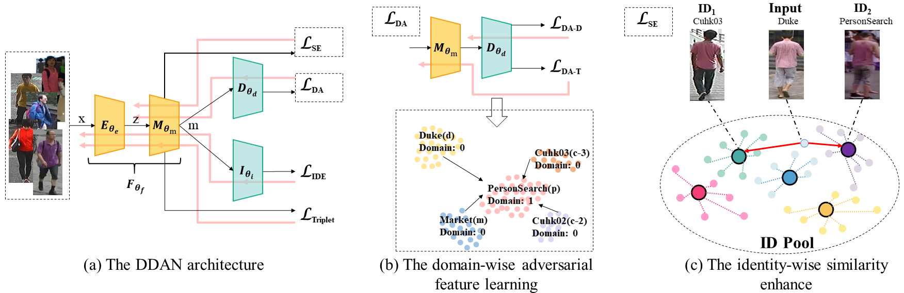

# Dual Distribution Alignment Network for Generalizable Person Re-Identification

This resposity is the official implementation of our AAAI2021 [Paper](https://arxiv.org/abs/2007.13249). 


#### Dependent
* Python 3.7.5
* PyTorch == 1.3.1
#### Datasets
You maybe need the [CUHK-SYSU](https://drive.google.com/file/d/1yoQOTp--ULGPct6erCsAQ_hd46hENE5G/view?usp=sharing).
Other datasets are available from the original author's open source website. 
#### Usage
* train/test 
```
bash run.sh
```

#### Citations
If our paper helps your research, please cite it in your publications:
```
@article{chen2020dual,
  title={Dual Distribution Alignment Network for Generalizable Person Re-Identification},
  author={Chen, Peixian and Dai, Pingyang and Liu, Jianzhuang and Zheng, Feng and Tian, Qi and Ji, Rongrong},
  journal={arXiv preprint arXiv:2007.13249},
  year={2020}
}
```

